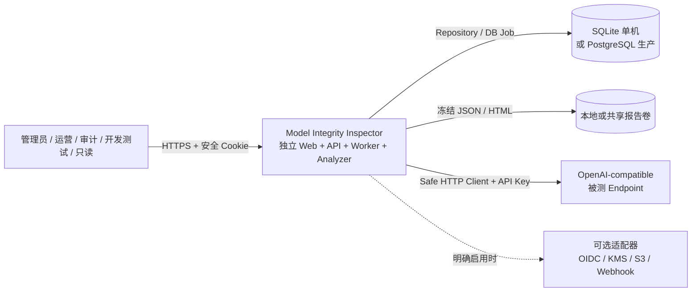
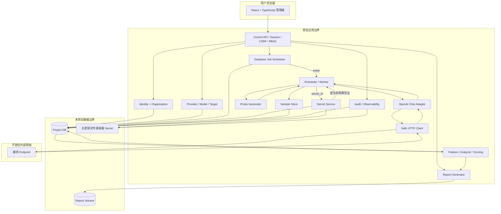

# Model Integrity Inspector System Architecture V1.0

Status: Accepted  
Date: 2026-09-04  
Task: M0-02  
Baselines: PRD V1.0 frozen, TECH SPEC V1.0 frozen
Approval: 项目方于 2026-09-04 批准 M0-02 架构与 ADR 包

## 1. Architecture outcome

系统采用独立部署的模块化单体。一个 Go 可执行文件通过 `APP_ROLE=server | worker | all` 承载 Control API、嵌入式 React 静态前端、数据库 Worker、Analyzer 和 Report Generator。模块通过显式接口隔离，生产环境可用相同制品拆分 Server/Worker 实例；单机模式使用 SQLite，标准生产模式使用 PostgreSQL。

核心登录、组织/RBAC、供应商/模型档案、目标、数据库 Job、检测、分析和本地报告均不依赖 Redis、S3、OIDC、KMS 或其他业务系统。可选组件只能位于适配器边界之后。

## 2. System context



## 3. Runtime containers and trust boundaries



信任边界规则：

- 浏览器、上游响应和所有外部 Endpoint 均视为不受信输入。
- API 在 Handler、RBAC 和 Repository 三层执行身份与组织作用域检查；后台 Job 消费时再次校验 `organization_id`。
- Worker 只能通过 Secret Service 按 `secret_id` 获取短生命周期凭证；Safe HTTP Client 不解析 `secret_id`、不主动读取 Secret，也不持久化或记录鉴权 Header。
- Secret 明文只允许存在于 Worker 出站请求作用域及底层发送所必需的短生命周期内存，不进入结构化日志、Trace、报告、错误或普通序列化对象。
- 模型返回内容以纯文本数据处理；管理端默认转义，不执行 HTML/Markdown 脚本。
- 主密钥位于业务数据库之外；备份不包含明文主密钥。

## 4. Module boundaries

| Module | Owns | May call | Must not own/do |
|---|---|---|---|
| `identity` | 初始化、本地账号、密码、会话 | repository, audit | 检测协议、Secret 明文 |
| `organization/rbac` | 成员、角色、权限和 scope | repository, audit | 仅靠前端做隔离 |
| `catalog` | Provider、Model Profile | repository | 外部模型目录成为事实源 |
| `target` | Endpoint、协议、模型、配置引用 | repository, secret metadata, safehttp validation | 回显或另存 Key/自定义 Header；直接发网络请求 |
| `secret` | 信封加密、掩码、轮换、指纹 | master-key adapter, repository, audit | 通用 JSON 序列化；记录明文 |
| `safehttp` | URL/DNS/IP/TLS/重定向/大小/超时 | resolver, dialer, observability | 解析 `secret_id`、调用 Secret Service、写样本、协议评分或跨目标共享凭证 |
| `adapter/openaichat` | 请求映射、JSON/SSE 解析、错误归一 | safehttp, tokenizer interface | 判定真实性风险 |
| `jobqueue` | Job 领取、租约、续租、重试、回收 | repository, clock | 存储密钥或正文 |
| `scheduler/worker` | 预算、并发、派发、取消、短生命周期凭证作用域 | jobqueue, probe, secret, adapter, sample | 记录凭证明文；修改发布分或报告 |
| `probe` | 模板、随机化、Manifest | rules storage, CSPRNG | 使用真实用户内容 |
| `sample` | LogicalSample/Attempt、脱敏采集 | repository, content encryption | 把重试当成新统计样本 |
| `feature/analyzer` | 有效性、特征、统计、Finding | sample read model, baseline | 调用上游或读取 Secret |
| `scoring` | 四维分、综合分、置信度、证据等级 | analyzer outputs, versioned rules | 让模型自述参与评分；黑盒升 A |
| `baseline` | 审批、有效期、配对引用 | repository, audit | 跨组织共享凭证 |
| `report` | canonical JSON、HTML、哈希 | published analysis, filesystem adapter | 读取或解密 API Key |
| `audit/observability` | 追加式审计、完整性链、指标、结构化诊断 | redaction layer, repository, audit integrity key | 更新既有审计事件；记录默认正文或高基数指标标签 |

依赖方向固定为入口层 → 应用编排 → 领域接口 → 基础设施适配器。Adapter 只负责协议，Probe 负责实验，Analyzer 负责判断，Scoring 负责聚合。禁止把规则散落到 Handler、页面、Adapter 或 SQL 查询中。

## 5. Primary data flows

### 5.1 Setup and login

1. Server 检查配置、主密钥可用性、数据库连接和迁移版本。
2. 未初始化时只开放 setup 和健康接口。
3. 初始化事务创建首个组织、管理员、基础角色和内置包记录；成功后关闭初始化写入口。
4. 登录创建哈希会话记录，浏览器只接收安全 Cookie；每次请求执行 CSRF、会话、权限和组织检查。

### 5.2 Create target and rotate secret

1. API 校验 Endpoint 语法和保留 Header，调用 Safe HTTP URL policy 进行无网络的初步验证。
2. Secret Service 生成随机 DEK，使用 AES-256-GCM 加密 API Key 与全部自定义 Header 组成的凭证载荷，再由版本化主密钥包裹 DEK。
3. 目标只保存 `secret_id`，不得另建第二份 Header 密文；API 仅返回掩码和元数据。
4. 轮换创建新 Secret 版本并审计，历史报告不访问旧密钥。

### 5.3 Run execution

1. 创建 Run、冻结配置/规则/模板/tokenizer 版本并在同一事务写入首个 Job。
2. Worker 领取租约，生成合成探针和不可变 Manifest。
3. Worker 通过 Secret Service 将 `secret_id` 解析为短生命周期凭证作用域；Adapter 构建请求，Safe HTTP Client 仅负责发送已构建且受脱敏保护的请求，并重新解析、校验和固定连接 IP，同时保留 TLS SNI hostname。
4. 每次外部调用写 Attempt；LogicalSample 只引用最终有效 Attempt。预算计算包含失败和不确定调用。
5. 执行关闭后 Analyzer 生成 revision；Report Generator 从发布 revision 生成 JSON/HTML。

## 6. Database paths

| Mode | Database | Worker model | Intended use | Guardrail |
|---|---|---|---|---|
| Standalone | SQLite | 单进程、单活跃写领取器；读写短事务 | 试用、小团队、小规模正式部署 | 精确容量在 M7 冻结；禁止多主写 Worker |
| Standard production | PostgreSQL | 多 Server/Worker，`SKIP LOCKED` 领取 | 标准生产和水平扩展 | 必须使用 PostgreSQL；连接池与组织/目标限流 |

两种方言共享领域模型、迁移版本和 Repository 契约。锁、JSON、时间和 ID 行为通过方言适配器处理；数据库专用 SQL 被限制在基础设施层并需要双模式集成测试。

## 7. Deployment paths

```text
Standalone:
  mii executable + config + master key file + data directory
  APP_ROLE=all → embedded Web/API + Worker + Analyzer + SQLite + local reports

Docker Compose:
  same mii image (APP_ROLE=server) × N
  same mii image (APP_ROLE=worker) × N
  PostgreSQL + shared report volume + container Secret
```

React 构建产物通过 Go `embed` 进入同一服务制品。OIDC、KMS、S3-compatible storage、Redis/NATS 等实现只能注册为可选适配器；未配置时不加载，也不能影响本地登录、数据库 Job、文件报告和 Secret 文件模式。

运行角色与组件归属固定如下：

| `APP_ROLE` | 启动组件 | 不启动/约束 |
|---|---|---|
| `server` | Web、Control API、setup/auth/RBAC、管理查询、健康/指标；持迁移锁执行兼容迁移 | 不领取检测、分析或报告 Job |
| `worker` | Job consumer、Scheduler、Probe、Secret 出站作用域、Adapter、Safe HTTP、Sample、Analyzer、Report Job、reconciler、Worker 健康/指标 | 不提供管理端和业务写 API；只校验 schema 兼容性，不主动执行迁移 |
| `all` | `server` 与 `worker` 的并集 | SQLite 模式只允许此角色启动一个活跃 Job 领取器；PostgreSQL 可用于开发或小型一体化部署 |

同一数据库中只能由 `server`/`all` 竞争同一迁移锁；异步组件只能由 `worker`/`all` 领取版本兼容的 Job。Analyzer 与 Report Generator 通过独立 Job 幂等执行，不在 Server 请求路径同步运行。

## 8. Failure boundaries

| Failure | Contained behavior | Recoverability / diagnosis |
|---|---|---|
| 单个上游超时/429/5xx | 只影响当前 Attempt；按分类重试和预算计数 | 结构化错误、Retry-After、Attempt 链 |
| 上游返回恶意/超大内容 | Safe HTTP/parser 限长并标记客户端安全限制 | 样本不进入真实性评分；记录安全指标 |
| Worker 崩溃 | Server 历史查询继续；租约到期回收 | 15 秒续租、60 秒租约、不确定 Attempt 标记 |
| Analyzer 失败 | 原始样本保留，Run 可明确失败或重试分析 | `run_id + analysis_version` 幂等 |
| Report 文件写失败 | 发布分析结果仍在 DB，不丢检测结论 | 报告 Job 幂等重试，健康状态显示存储异常 |
| 可选 OIDC/KMS/S3/队列适配器失败 | 未启用时无影响；启用时只降级对应能力 | 本地账号、文件主密钥、数据库 Job、本地报告保留 |
| 主密钥不可用 | Secret Service 不就绪，禁止新外部调用 | 健康接口只返回分类状态，不泄漏路径/密钥 |
| 数据库不可用 | 禁止新写入和 Job 领取；不伪造成功 | readiness 失败、连接/慢查询指标、事务重试边界 |
| SQLite 写竞争 | 单领取器和短事务限制影响范围 | 指标暴露锁等待；超过验证容量迁移 PostgreSQL |
| 报告卷容量不足 | 停止新报告写入，不删除已有报告或分析 | 告警、清理策略、备份/扩容 Runbook |
| 进程取消/升级 | 停止领取新 Job，安全结束或释放在途租约 | expand/deploy/contract，保留 DB 和报告 |

## 9. Audit integrity boundary

- `integrity_audit_logs` 在应用权限下只允许追加，禁止更新既有事件；保留期清理由独立维护路径处理密封分段。
- 每个组织在 `integrity_audit_chain_heads` 中维护串行化链头。事件对规范化字段、前序哈希和密钥版本执行 HMAC-SHA-256，完整性密钥与 Secret 包裹及指纹密钥用途分离并位于业务数据库之外。
- PostgreSQL 通过组织链头行锁串行追加；SQLite 依赖单写事务。读取、备份恢复和健康检查可验证链连续性。
- 默认 365 天后只能删除已密封分段，并永久保留不含敏感正文的分段起止哈希、数量、时间范围和删除审计事件。
- 该机制保证普通用户和应用写路径不可改写，并使数据库离线篡改可检测；不声称能够抵御同时控制数据库、应用制品和外置完整性密钥的主机超级管理员。

完整方案与失败策略见 `../adr/ADR-0006-audit-log-integrity.md`。

## 10. Security and data consequences

- S3（极敏感级）API Key/代理凭证：信封加密，只写不可回显；明文生命周期局限于 Worker 出站请求作用域。
- S2 完整请求/响应：合成请求，响应限长后加密；默认 30 天，可配置关闭。
- S1 评分、Usage、延迟：组织隔离；报告导出与正文访问审计。
- Endpoint 出网：默认仅 HTTPS、公网可路由地址、无重定向；内网必须管理员 CIDR allowlist。
- 所有模块日志先经统一 redaction；Trace 不记录 Header、URL query、正文或 Secret。

## 11. Architecture verification responsibilities

- M0-03：建立与本架构一致的目录、Go module、React 工程和一条命令构建。
- M0-04：CI 验证模块依赖、测试、lint、漏洞、SBOM 和制品哈希。
- M1-01/M1-06：用 SQLite/PostgreSQL 自动化验证迁移和 Job 语义。
- M2-02/M2-03：验证 Secret 零明文和 SSRF 禁止地址零绕过。
- M1-07/SEC-01：验证审计只追加权限、HMAC 链、并发追加、分段清理和离线篡改检出。
- M6/M7：验证部署、恢复、故障边界和精确容量上限。
